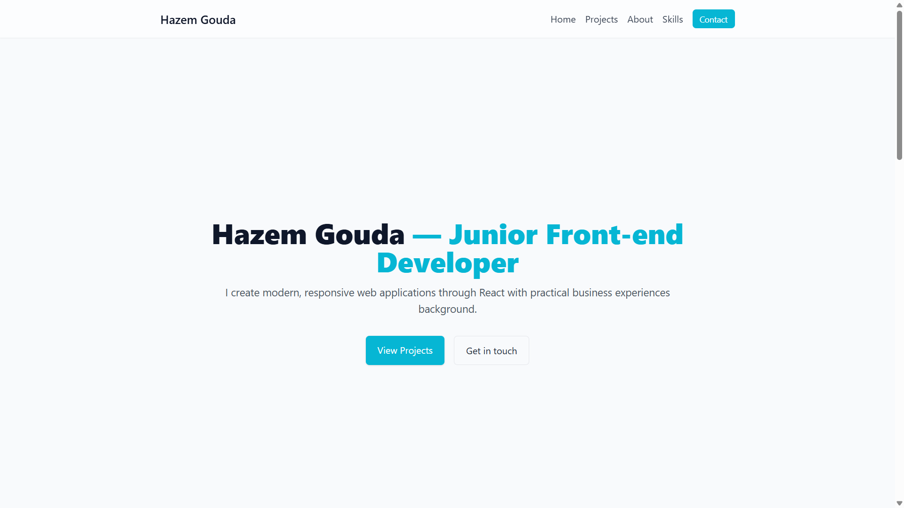

# 🌐 Hazem Gouda - Portfolio

A classy, simple, and responsive **portfolio website** built with **React** and **Tailwind CSS**.  
This project showcases my work, skills, and projects as a frontend developer.  

---

## 🚀 Live Demo

Click here to open the To-Do List app: 
 
[](https://hazem-gouda.github.io/portfolio)

---

## 🚀 Features
- ⚛️ **React** for a dynamic and modern user experience  
- 🎨 **Tailwind CSS** for fast, responsive, and elegant styling  
- 📱 **Fully Responsive** design for all screen sizes  
- 🖼️ **One-page Layout** with smooth scrolling and clean UI  
- 💼 Showcases **projects, skills, and contact info**
- 🧪 Tested with **Jest + React Testing Library (RTL)**  
- ♿ Improved **Accessibility (a11y)** for better user experience  

---

## 🛠️ Tech Stack
- **React**  
- **Tailwind CSS**  
- **JavaScript (ES6+)**  
- **Responsive Web Design**  

---

## 📸 Screenshots

| 
| 
| 
| 

---

📄 License
This project is licensed under the MIT License — feel free to use and modify it.

Made with ❤️ by Hazem Gouda
---
### 📦 Installation

```bash
# Clone the repo
git clone https://github.com/hazem-gouda/weather-app.git

# Navigate into the directory
cd weather-app

# Install dependencies
npm install

# Start the development server
npm start
